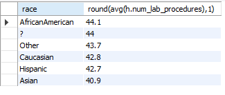
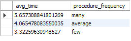
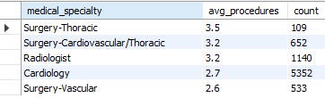
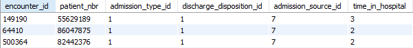
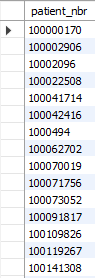
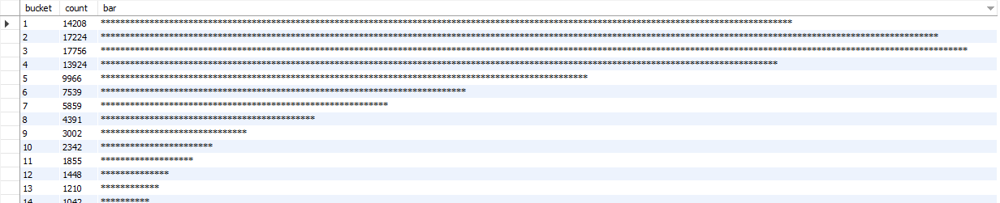
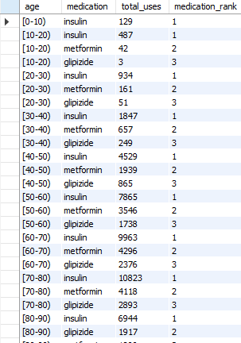

# Healthcare Investigation


### Introduction
I received a a large dataset from a hospital outlining patient information and many other variabels. I believe it is worth looking deeper in the dataset to understand the efficacy of procedures, medications and the fair treatment of all patients. In this project I aim to understand several of these relationships that can be found in Healthcare data, with the goal of learning what is done well and what could be improved. I will provide the SQL queries and images of the outputted table. Some queries will have comments to clarify what each aspect of the query does.

### What will you learn from the data of this specific Hospital
a) In terms of the average number of lab procedures, all races are treated equally.

b) The average time spent in the hospital has a correlation with the number of procedures received.

c) The most common procedures are Cardiology and Radiology visits, along with Surgery of the Thoracic and Vascular systems.

d) A list of patients that left the hospital faster than average after an emergency.

e) The number of patients who are African-American or have an "Up" to metformin.

f) The distribution of time spent in the hospital.

g) A list of the top 3 medications ranked per age group 

### Dataset and tools
The dataset could be found here: https://www.kaggle.com/code/iabhishekofficial/prediction-on-hospital-readmission/data?select=diabetic_data.csv

I used MySQL Workbench to create queries and output tables.

### Data Analysis

#### a) Is the hospital subconsciouly treating races differently?
In order to figure out if the hospital is subconsciously treating races differently, we looked at the average number of lab procedures by race. We used the query below
```SQL
select 
	d.race, 
    round(avg(h.num_lab_procedures),1) 
from health as h
	join demographics as d on h.patient_nbr = d.patient_nbr
    group by d.race
    order by avg(h.num_lab_procedures) DESC;
```
The following output shows that the hospital is not treating races differently, as each race has nearly the same average number of lab procedures.



#### b) What is the relationship between the number of lab proceudres and time spent in the hospital? 
In order to examine the relationship clearly, I want to group the output into buckets of "few", "average", and "many" to show the diffrences in time spent between groups with different amounts of lab procedures. The following query executes this idea.
```SQL
select
	avg(time_in_hospital) as avg_time,
	case when num_lab_procedures >= 0
		and num_lab_procedures <= 25
		then 'few'
	when num_lab_procedures >= 25
		and num_lab_procedures < 55
		then 'average'
	else 'many'
    end as procedure_frequency
from health
group by procedure_frequency
order by avg_time desc;
```
The output below confirms an intuitive understanding that, the larger number of lab procedures that a patient undergoes, the higher time spent in the hospital on average.



#### c) Provide a list of medical specialties that have an average number of procedure count above 2.5 with the total procedure count above 50.
The task is to find the most significantly reocurring procedures for medical specialities, while handling exceptions for cases that don't have a large sample size. The query below solves this.
```SQL
Select distinct medical_specialty,
	ROUND(AVG(num_procedures), 1) as avg_procedures, -- Gets the average first, than rounds it up to 1 decimal place in acolumn called avg_procedures.
	count(*) as count -- gives a count of the number of specciality procedures.
from health
group by medical_specialty -- Condensed list of specialities.
having count > 50
and avg_procedures > 2.5
order by avg_procedures DESC;
```
The output below shows us that radiology, cardiology, and surgery for cardiovascular and thoarcic systems are the most significantly reocurring procedures based on medical specialties.



#### d) Provide a list of patients who were admitted in an emergency and left the hospital faster than average.
In order to provide the list of patients, we had to find what an emergency is labeled as. Upon looking at the data, emergencies are classified as admission_type_id = 1. From there, we need to establish an average time stayed in the hospital. This is created from the WITH clause, setting the avg_time variable as the average time stayed in the hospital. Then we include a condition to be less than the average time alongside being equivalent to the emergency label. The query below demonstrates this.

```SQL
WITH avg_time AS (
	SELECT AVG(time_in_hospital) 
	FROM health
	) 
SELECT * FROM patient.health 
	WHERE admission_type_id = 1 
	AND time_in_hospital < (SELECT * FROM avg_time);
```
The output will be a list of patients who were admitted as an emergency and left the hospital faster than average.



#### e) Research needs a list of all patient numbers who are African-America or have a "Up" to metformin
In order to find the list, we used the query below. 
```SQL
SELECT patient_nbr FROM patient.demographics WHERE race = 'AfricanAmerican'
UNION
SELECT patient_nbr FROM patient.health
WHERE metformin = 'Up';
```
The main criteria to select from are if the patient is African American, alongside if their Metformin column is equal to "Up". Both columns were found on different tables, the demogrpahics and health tables. As a result, we have to use the Union clause with the common identifier being patient number, to output a list of patients that match both criteria.



#### f) What is the distribution of time spent in the hospital?
The distribution of time spent in the hospital is displayed by this query.
```SQL
Select round(time_in_hospital, 1) as bucket 
, count(*) as count 
, rpad('', count(*)/100, "*") as bar
```

The output is a Histogram. The result shows that most patients fall in the buckets of 1-4 for time spent in the hospital. Longer stays happen less often.



#### g) What are the top 3 medications ranked per age group.
In order to determine the top 3 medications, and rank them per age group, we used the following query.
```SQL
WITH long_health_cte AS (
SELECT patient_nbr, 'metformin' AS medication, metformin AS med_usage FROM patient.health
UNION
SELECT patient_nbr, 'glipizide' AS medication, glipizide AS med_usage FROM patient.health
UNION
SELECT patient_nbr, 'insulin' AS medication, insulin AS med_usage FROM patient.health
)
SELECT
age, -- Takes the imported and aggregated age column.
medication, -- Uses the newly created medication column.
COUNT(*) AS total_uses, -- Creates a new column called total_uses, which determines how many are in the adjacent bucket. (Age/Medication)
RANK() OVER (PARTITION BY age ORDER BY COUNT(*) DESC) AS medication_rank -- Final column. Partitions it by age buckets. Order the age buckets by count in descending manner. Creates a ranking out of this order.
FROM long_health_cte -- Temporary table that we are using.
JOIN patient.demographics ON long_health_cte.patient_nbr = demographics.patient_nbr -- Allows for the age column to be used. Common column identified is patient_nbr.
WHERE med_usage NOT IN ('No') -- Excludes any instances where medicine is not used
GROUP BY medication, age -- Allows for similar medication, followed by similar ages to be combined into the same bucket for counting.
ORDER BY age, medication_rank; -- Orders by the age, then the medication rank. Default is from smallest to largest.
```
The result is the following list.



### Conclusion
This analysis provides insight into patterns of hospital utilization, procedures, and medication use across a diverse patient population. On average, patients of different racial backgrounds received a comparable number of laboratory procedures, suggesting equity in procedural allocation. At the same time, a clear correlation emerged between the length of hospitalization and the number of procedures performed, reflecting that more complicated procedures require more time in the hospital. The most common procedures were concentrated in cardiology, radiology, and thoracic or vascular surgery, highlighting the significance of cardiovascular and diagnostic care. While most patients followed the average trajectory for discharge, a subset of individuals were released more rapidly after emergency admissions, showing the strong level of care in crisis situations. Demographic analysis also highlighted a substantial representation of African-American patients that were prescribed metformin with an “Up” adjustment, showing an important intersection of race and diabetes management. Finally, medication use varied significantly by age, with each age group relying on metformin, insulin and glipozide. Together, these findings illustrate how treatment patterns, demographics, and pharmacology interact to shape hospital experiences and outcomes.
### Call to Action
If you were interested in discussing the dataset further or have feedback on the analysis, feel free to message me on [LinkedIn!](https://www.linkedin.com/in/andhyalvarez/)

