# World Bank Credits and Loans SQL Analysis

## 
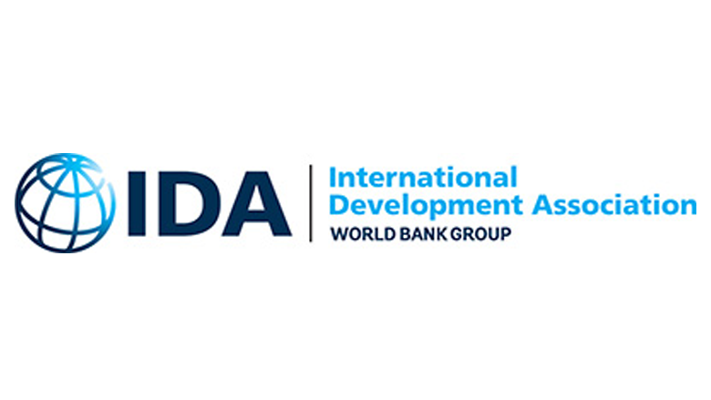

### Introduction
The World Bank Group periodically publishes data concerning loans and credits that it gives out to developiong countries. The dataset is interesting because it can give a snapshot of how much help a country is receiving, while also showing their ability to pay off loans over time. 

### What will you learn
a) The scope of the World Bank's dataset.

b) Nicaragua's total transactions with the World Bank.

c) The total amount of transactions, and the total amount of transactions per country.

d) The max amount owed to the IDA

e) What country has the most loans owed to the IDA?

### Dataset and tools
The dataset is provided by the World Bank, up to the most recent quarter on August 2025. The dataset contains loan information from many countries, such as the service charge rate, amount due to the IDA (International Development Association), amount repaid to the IDA and so on. Each row in the dataset represents a transaction between a country and the IDA. Loan transactions are recorded back to June 29, 1961 up to the present.
For this project, I used SQL queries to analyze certain aspects of the data. I will provide the SQL code and query output below.

### Data Analysis

#### a) Dataset
The first query is meant to return the whole table from the dataset. I had to include a LIMIT 500 because the dataset was very large. Keep in mind a majority of the following query outputs will be shortened because it can't be contained in a screenshot.
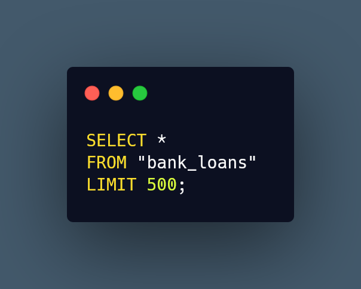
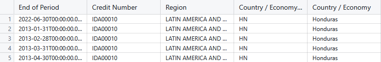

#### b) Borrower and amount due to the IDA
The next aspect of the dataset we are looking at is how much each borrower owes to the IDA. To find this out, I entered the query below and got a table showing all borrowers and the amount they owe to the IDA. Looking at the output, there are more borrowers that owe 0 to the IDA than there are those that owe some amount to them.
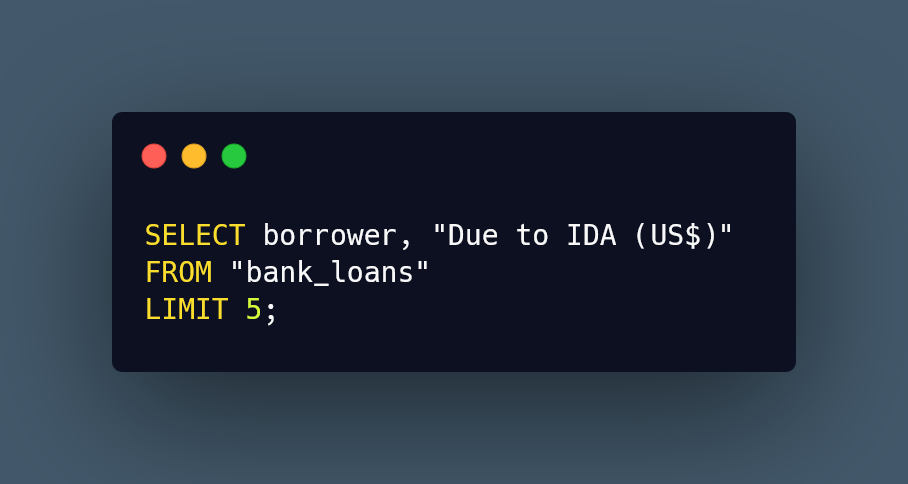
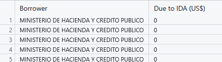

#### c) Show us all transactions from Nicaragua
We want to see transactions from Nicaragua only, so we input this query. Looking at the query output, we can see that Nicaragua does a good job at repaying their loans. A majority of their credit status is fully repaid, or partially repaid. This stability is further reflected in the service charge rate staying 0.75 across all of their transactions with the IDA.
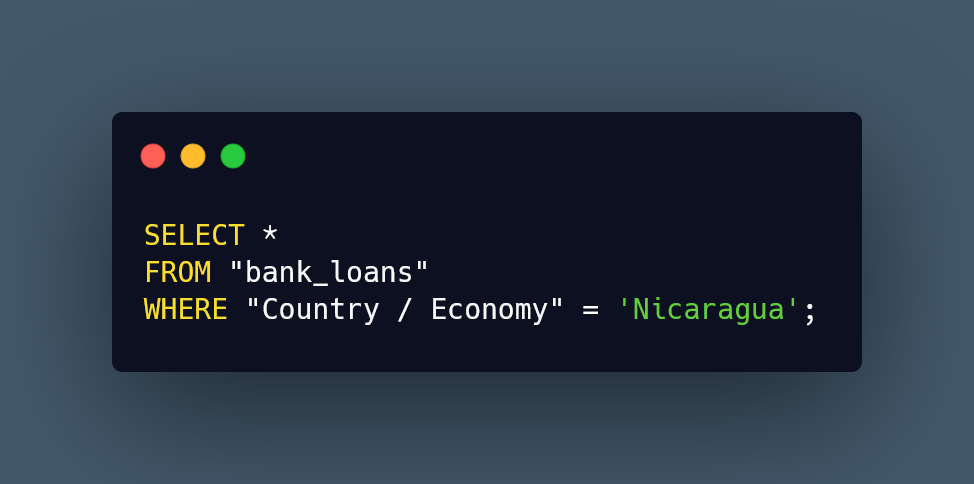
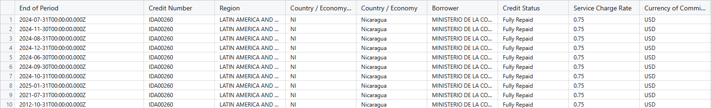

#### d) How many Total Transactions
The total amount of transactions can be found from the Query below. The output is 1,443,906 transactions, showing a lot of volume between countries and the World Bank.
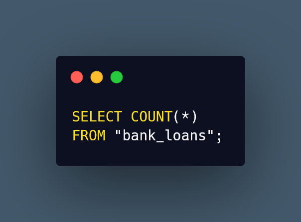
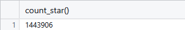

#### e) How many Total transactions Per Country?
The total transactions per country is found by the query below. I ordered the output with the phrase "Order By" and made sure it starts from the countries that have the most transactions with the phrase "Desc". From the output we can see South Asia represented heavily, with India, Bangladesh and Pakistan having the top 3 most transactions with the IDA. Africa is well represented too, with the remaining countries in the top 10 coming from Africa. 
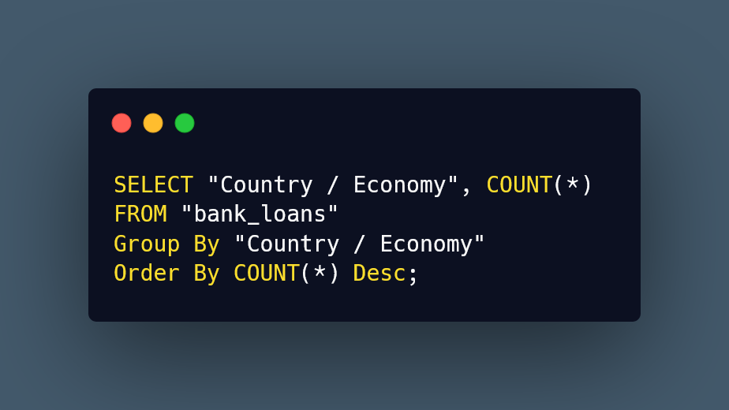
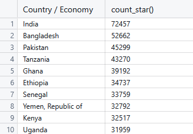

#### f) What is the Max owed to the IDA?
The max amount owed to the IDA can be found by the query below. The output shows us that the most owed is $4,800,000,000.
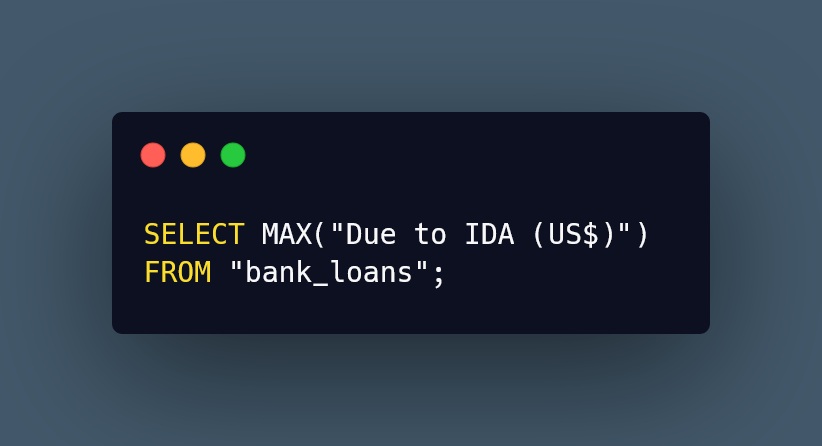
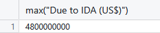

#### g) Who has the most loans?
The country with the most loans is India with $3,878,789,578,329.68, followed by Bangladesh and Pakistan. This tracks with their high volume of transactions that we learned of previously.
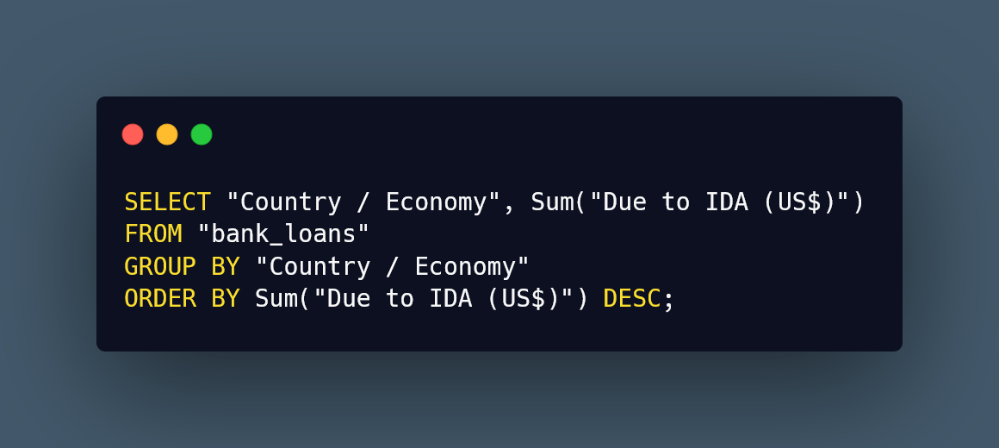
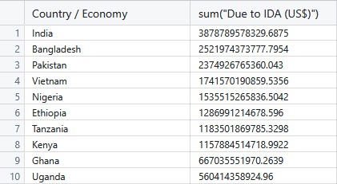
### Conclusion

### Call to Action
If you were interested in discussing the dataset further or have feedback on the analysis, feel free to message me on [LinkedIn!](https://www.linkedin.com/in/andhyalvarez/)

