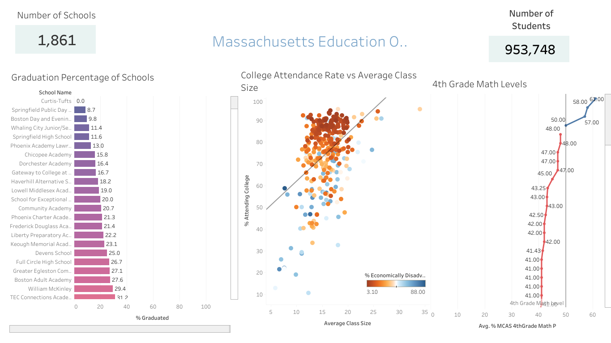

# Bank Project

## Massachusetts Education System Analysis

### Introduction

### What will you learn

### Dataset and tools
The dataset is provided by the Massachusetts Department of Education. It contains performance metrics from 1,861 schools and 953,748 students. I input this data into Tableau to create visualizations for the relationships that we are investigating. [Here is a link to the dataset.](https://www.kaggle.com/datasets/ndalziel/massachusetts-public-schools-data)

For this project, I created a Dashboard on Tableau. [Feel free to take a look for yourself!](https://public.tableau.com/app/profile/andhy.alvarez/viz/Book2_17530197870140/Dashboard1?publish=yes)

### Data Analysis
The sample size of the dataset includes 1,861 schools and 953,748 students. We will investigate a few KPI's to get a clear picture on the performance of the education system.

#### a)

#### b)

#### c)

### Conclusion

### Call to Action
If you were interested in discussing the dataset further or have feedback on the analysis, feel free to message me on [LinkedIn!](https://www.linkedin.com/in/andhyalvarez/)

