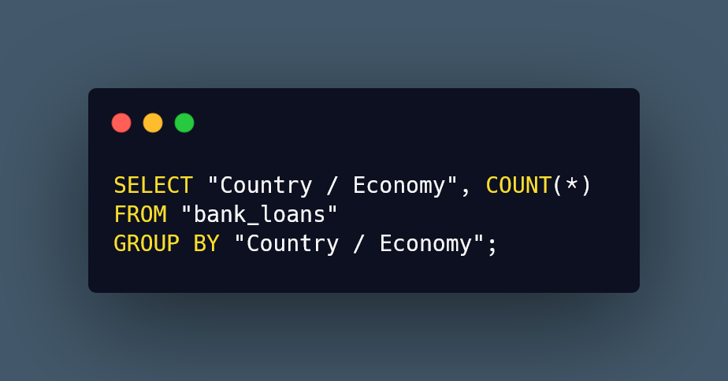

# Bank Loans SQL Analysis

## 

### Introduction
Working with a data set from the World Bank, the following project will analyze bank loans to many countries and derive insights from it.

### What will you learn

### Dataset and tools
The dataset is provided by the World Bank, up to the most recent quarter on August 2025. The dataset contains loan information from many countries, such as the service charge rate, amount due to the IDA (International Development Association), amount repaid to the IDA and so on. Each row in the dataset represents a transaction between a country and the IDA.
For this project, I used SQL queries to analyze certain aspects of the data. I will provide the SQL code and query results below.

### Data Analysis

#### a) Return the whole dataset

#### b) Return the rows of the table, but only Borrower and IDA columns
.png)

#### c) Show us all transactions from Nicaragua

#### d) How many Total Transactions

#### e) How many Total transactions Per Country?

#### f) What is the Max owed to the IDA?

#### g) Who has the most loans?

### Conclusion

### Call to Action
If you were interested in discussing the dataset further or have feedback on the analysis, feel free to message me on [LinkedIn!](https://www.linkedin.com/in/andhyalvarez/)

